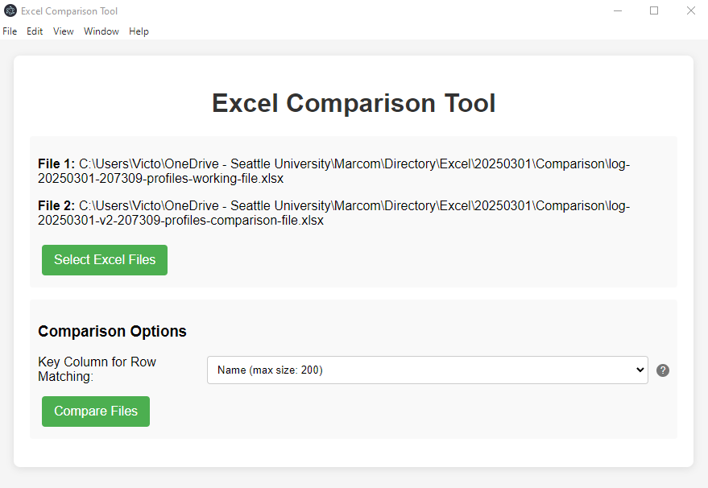

# Excel Compare Tool

A desktop application that allows users to quickly and easily compare two Excel files and identify differences between them. Built with Electron for a seamless cross-platform experience.



## Features

- Simple and intuitive graphical user interface
- Select Excel files using file browser
- **Key Column Matching**: Compare rows based on matching values in a selected column instead of just position
- Detailed comparison showing all differences between files
- Resizable table cells for easy viewing of large content
- Comparison of sheet structure and cell values
- Works with .xlsx and .xls file formats
- Available as a standalone Windows application (no installation of Node.js required)

## Installation

### Option 1: Download the Installer

1. Go to the [Releases](https://github.com/vicchimenti/excel-compare-tool/releases) page
2. Download the latest `Excel Compare Tool Setup x.x.x.exe` file
3. Run the installer and follow the prompts
4. Launch the application from your Start menu or desktop shortcut

### Option 2: Build from Source

1. Clone this repository:

   ```bash
   git clone https://github.com/vicchimenti/excel-compare-tool.git
   cd excel-compare-tool
   ```

2. Install dependencies:

   ```bash
   npm install
   ```

3. Run the application in development mode:

   ```bash
   npm start
   ```

4. Build the application for your platform:

   ```bash
   # For Windows

   npm run build:win

   # The installer will be created in the dist folder
   ```

## Usage

1. Launch the Excel Compare Tool
2. Click "Select Excel Files" and choose two Excel files to compare
3. Optional: Select a key column for row matching (rows with identical values in this column will be compared regardless of their position)
4. Click "Compare Files" to start the comparison
5. View the results showing all differences between the files
6. Use the following features to better visualize differences:
   1. Drag column dividers to adjust column width
   2. Double-click cells to expand/collapse height for viewing large content

### Command Line Usage

The tool can also be used from the command line:

```bash
# Basic comparison

excel-compare path/to/file1.xlsx path/to/file2.xlsx

# With key column specified

excel-compare path/to/file1.xlsx path/to/file2.xlsx --key-column "ID"

# Or using npx

npx excel-compare-tool path/to/file1.xlsx path/to/file2.xlsx
```

## Development

### Project Structure

```excel-compare-tool/
├── main.js                 # Electron main process
├── preload.js              # Preload script for secure IPC
├── index.js                # Excel comparison logic
├── index.html              # HTML structure for UI
├── styles.css              # CSS styling for UI
├── renderer.js             # Frontend JavaScript logic
├── package.json            # Project configuration
└── icon.ico                # Application icon
```

### Building from Source

1. Make sure you have Node.js installed (v14 or later recommended)

2. Clone the repository

3. Install dependencies:

   ```bash
   npm install
   ```

4. Run in development mode:

   ```bash
   npm start
   ```

5. Build installers:

   ```bash
   npm run build:win
   ```

## Technology Stack

- Electron: Cross-platform desktop application framework
- XLSX: Excel file parsing and manipulation
- Commander: Command-line interface support
- JavaScript/HTML/CSS: User interface

## License

This project is licensed under the MIT License - see the [LICENSE](LICENSE) file for details.

## Acknowledgments

- [SheetJS](https://github.com/SheetJS/sheetjs) for Excel file parsing
- [Electron](https://www.electronjs.org/) for the application framework
- [Commander](https://github.com/tj/commander.js/) for CLI argument parsing